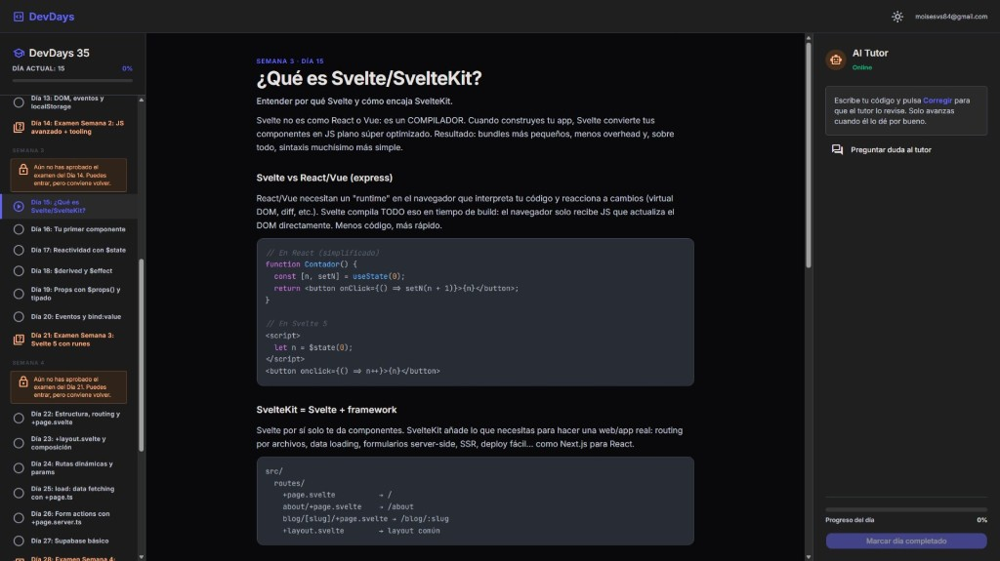

# DevDays — My internal bootcamp to stop copy-pasting and start understanding

[🇪🇸 Español](./README.md) · **🇬🇧 English**

> I've spent years building websites with WordPress. Now I'm making the jump to modern development (SvelteKit, TypeScript, Supabase) and learning how to get real leverage from AI.
> But there's one thing I'm clear about: **I don't want to depend on AI. I want to understand what I'm doing.**

So I built my own internal bootcamp: a **35-day platform** that combines lessons, hands-on exercises, and an AI tutor that reviews my code. Every day I study a topic, code it, the tutor reviews it, and I only move forward when I prove I've understood it. At the end of each week there's a **gated exam**: fail it and you don't move to the next block.

The stack is exactly what I'm learning:

- **SvelteKit 5** with runes (`$state`, `$derived`, `$effect`, `$props`)
- **TypeScript** strict mode everywhere
- **Supabase** for auth (Magic Link) and the database
- **Tailwind CSS v4** + Material 3 design tokens
- **CodeMirror 6** as a real editor with syntax highlighting
- **OpenAI + Gemini** with automatic failover when one of them goes down

When I finish the 35 days, the plan is to re-read the codebase line by line and refactor whatever needs refactoring — now actually understanding what each piece does. And start looking for a frontend job.

📫 **If you want to talk about projects or roles:** [info@moisesvalero.es](mailto:info@moisesvalero.es) · 🌐 [moisesvalero.es](https://moisesvalero.es)

---

## Screenshot



The three columns in action: day list with weekly soft-lock on the left, lesson with syntax-highlighted code blocks in the center, and the AI tutor waiting for code on the right.

---

## What the app does

An interactive **3-column portal**:

| Column | Content |
|--------|---------|
| **Left** | The 35 days as circles (gray = pending, green = done). Soft-lock per week if you didn't pass the previous exam. |
| **Center** | Structured lesson (intro, sections, examples, callouts, summary) + numbered exercises + a CodeMirror editor in dark theme. |
| **Right** | The AI tutor's response after hitting **Corregir** (correct). It gives hints, code snippets, and only unlocks the "Mark day completed" button when the code is actually correct. |

### The fun meta-loop

I built the platform myself, and now I'm **using it to learn the very same things I used to build it**.

### Progression rules

- **Regular lessons (days 1–6, 8–13, …):** 3 exercises per day. You must pass **all 3** to advance.
- **Exams (days 7, 14, 21, 28, 35):** 5 exercises. You need to pass **at least 4 out of 5** to "Aprobar examen" (Pass the exam).
- The student **never** decides whether they're right. Only the `/api/corregir` endpoint can mark an exercise as passed.

---

## Architecture (mental picture)

```
Browser
   │
   ├─ /estudio  (3 columns, CodeMirror, AskTutorDialog)
   │     │
   │     │  POST /api/corregir       ┌──────────────┐
   │     ├──────────────────────────▶│ AI Orchestr. │──▶ OpenAI ─┐
   │     │  POST /api/preguntar      │   (ai.ts)    │           │ fallback
   │     ├──────────────────────────▶│              │──▶ Gemini ◀┘
   │     │                           └──────────────┘
   │     │
   │     └─ Supabase  (Magic Link auth + `progreso` table)
   │
   └─ hooks.server.ts  → auth guard + security headers (CSP, HSTS, …)
```

### Design decisions worth highlighting

1. **The student can't skip topics.** The `correcto: true` flag only comes from the server. Tampering with the client doesn't help.
2. **Email allowlist.** The portal is personal. `ALLOWED_EMAILS` separates friends from the open internet.
3. **AI failover.** If OpenAI fails, the orchestrator at `src/lib/server/ai.ts` falls back to Gemini with exponential backoff. If both fail, the frontend shows a clear error and lets you retry.
4. **Security headers.** `hooks.server.ts` sets CSP, HSTS, Permissions-Policy, X-Frame-Options, and friends. Not Fort Knox, but not the typical wide-open starter either.
5. **Forced dark mode in editor and login.** It's a study app: zero distractions.
6. **Discriminated types.** `Leccion = LeccionNormal | LeccionExamen`. The editor always knows whether it should render 3 or 5 exercises and which copy to show. No `any`, no `as`.

---

## Full stack

| Layer | Tech |
|-------|------|
| Framework | SvelteKit 2 + Svelte 5 (runes) |
| Language | Strict TypeScript |
| Styling | Tailwind CSS v4 + Material Design 3 variables |
| UI | shadcn-svelte (button, card, dialog, input, label, textarea, sonner, spinner) |
| Editor | CodeMirror 6 with One Dark theme and `@codemirror/lang-javascript` |
| Auth + DB | Supabase (`@supabase/ssr` + Magic Link) |
| AI | OpenAI (`gpt-5.4-mini`) + Gemini (`gemini-2.5-flash`) with failover |
| Code highlighting | highlight.js for lesson code blocks |
| Deploy | Vercel (`@sveltejs/adapter-vercel`) |
| Quality | ESLint, Prettier, svelte-check, Vitest |

---

## Running it locally

Requirements: **Node 22+**.

```bash
git clone <this-repo>
cd DevDays
npm install
cp .env.example .env
# Fill .env with your Supabase keys and at least one AI key
npm run dev
```

Open `http://localhost:5173`. It redirects to `/estudio`, asks for a Magic Link login, and you're studying.

### Supabase `progreso` table

```sql
create table progreso (
  user_id uuid references auth.users on delete cascade,
  dia int not null,
  estado text not null default 'completado',
  fecha timestamptz not null default now(),
  primary key (user_id, dia)
);

alter table progreso enable row level security;

create policy "own progress read" on progreso
  for select using (auth.uid() = user_id);

create policy "own progress insert" on progreso
  for insert with check (auth.uid() = user_id);
```

### Deployment

See `DEPLOY.md` for the full checklist (env vars, Supabase redirect URLs, etc.).

---

## Repo structure

```
src/
├─ app.css                     Tailwind v4 + Material 3 tokens
├─ app.html
├─ hooks.server.ts             Auth + security headers
├─ lib/
│  ├─ components/
│  │  ├─ study/                DayList, LessonContent, CodeEditor, AiTutor, AskTutorDialog, CodeBlock, Callout
│  │  ├─ ui/                   shadcn-svelte (button, card, dialog, input, …)
│  │  └─ ToastContainer.svelte
│  ├─ data/lessons.ts          The 35 hardcoded lessons
│  ├─ types/lesson.ts          LeccionNormal | LeccionExamen
│  ├─ server/
│  │  ├─ ai.ts                 Orchestrator OpenAI → Gemini
│  │  ├─ openai.ts             OpenAI with JSON schema
│  │  ├─ gemini.ts             Gemini with exponential retries
│  │  ├─ allowlist.ts          Email whitelist
│  │  └─ supabase/             Supabase SSR client
│  ├─ i18n/                    Minimal base for cookie language
│  └─ stores/toast.ts
└─ routes/
   ├─ +layout.svelte           ModeWatcher + Toaster
   ├─ +page.ts                 Redirect to /estudio
   ├─ login/                   Magic Link login
   ├─ auth/callback/           Code → session exchange
   ├─ estudio/                 Portal with auth guard
   └─ api/
      ├─ corregir/             AI correction
      ├─ preguntar/            Free chat with the tutor
      └─ locale/               Language cookie
```

---

## Roadmap

- [x] 35-day curriculum with 5 exams
- [x] AI correction with OpenAI/Gemini failover
- [x] Email allowlist
- [x] Magic Link + RLS on Supabase
- [x] Dark/Light mode (editor and login always dark)
- [ ] Finish the 35 days myself
- [ ] Refactor line by line, this time actually understanding everything
- [ ] Start looking for a frontend job

---

## Why this is worth more than a Udemy course

Because when I'm done, **I'll be the one who refactors and explains the platform's code**. It's not a tutorial I copied. It's a system in production that mixes auth, a database, two AI providers, weekly soft-locks, and discriminated unions in TypeScript. And right now, I'm using it every day to learn what I still don't master.

If you want to chat about projects or frontend roles, drop me a line at [info@moisesvalero.es](mailto:info@moisesvalero.es) or stop by [moisesvalero.es](https://moisesvalero.es).
